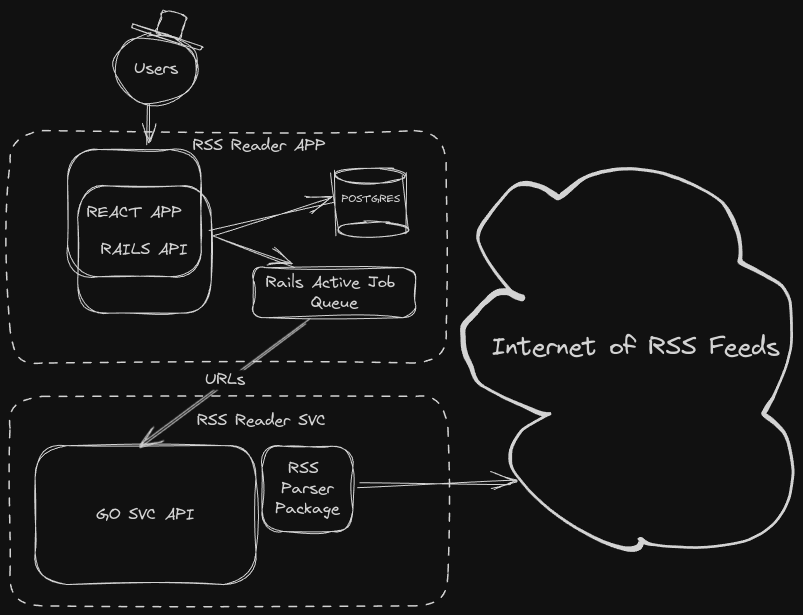

# RSS Reader
RSS Reader App that parses feed URLs and lists the posts.

# System Design


# Run locally

## Run with docker compose:
```bash
sudo docker compose up -d --build
```
If you want to seed demo data and kick off the feeds parser job:
```bash
sudo docker compose exec rssapp bin/rails db:seed
sudo docker compose exec rssapp bin/rails runner "FeedsParserJob.perform_now"
```
